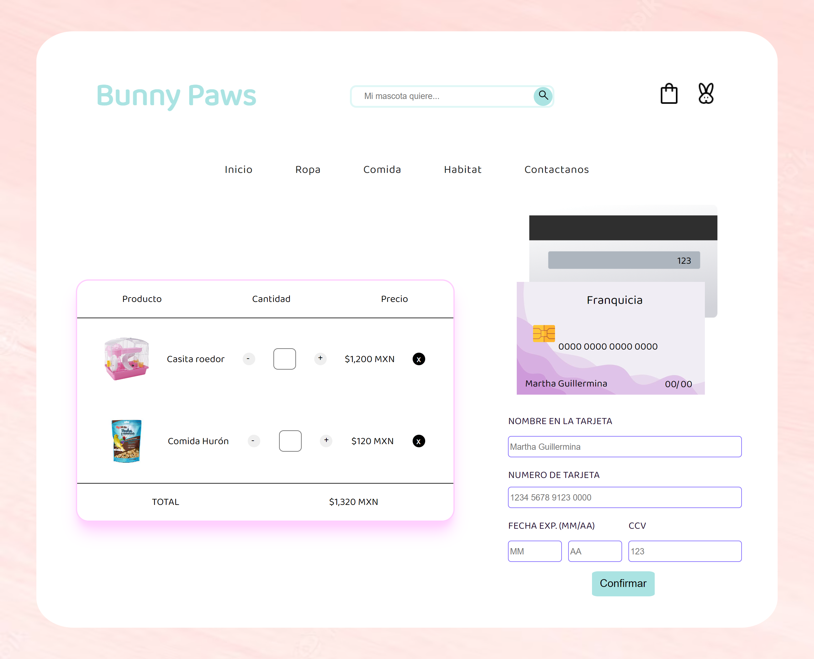
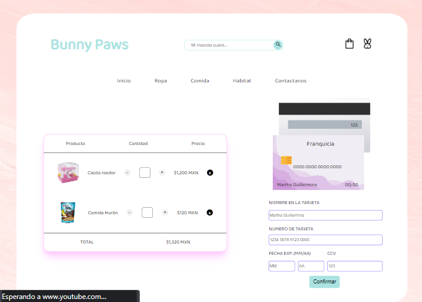
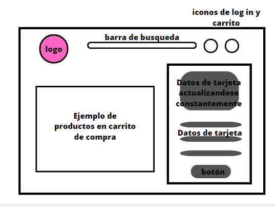

# Tarjeta de crédito válida

## Índice

* [1. Introduccion](#1-introducción)
* [2. Experiencia de usuario](#2-experiencia-de-usuario)
* [3. Decisiones de diseño](#3-decisiones-de-diseño)

***
## 1. Introducción

Este proyecto tiene como finalidad desarrollar una página que, mediante un formulario, se haga uso del algoritmo de Luhn para verificar cualquier número de tarjeta que el usuario decida ingresar y ademas, ocultar los ultimos 4 digitos de ese mismo número. Este formulario cuenta con diversos campos a llenar, los cuales se deben tomar en cuenta para poder hacer uso de la aplicacion. 

El programa evaluará las siguientes condiciones:

* Ningun input se encuentra vacio.
* El input nombre no contiene números.
* El input del numero de tarjeta no contiene letras.
* El input del numero de tarjeta cumple con el algoritmo de Luhn.
* El input del mes se encuentra dentro del rango 1 al 12.
* El input del año es igual o mayor al año actual.
* El input de CCV tiene una extension de 3 digitos.

Interfaz de usuario:

## 2. Experiencia de usuario

El contexto en el que englobe este programa fue la simulacion de una pagina de e-commerce especializado en usuarios que tienen mascotas y deseen adquirir productos relacionados de primera y segunda necesidad (ropa, hábitat). El usuario podra validar sus datos de tarjeta, destinada a servir como método de pago mediante una página html. Una vez que el usuario seleccione el botón "confirmar", se verificaran sus datos de acuerdo a las condiciones previamente descritas.

Si cumple con todas esas condiciones, se le verificara al usuario que sus datos son correctos y podria continuar con su compra. Aunado a ello, el usuario podra verificar si su tarjeta corresponde
a alguna franquicia y ademas, visualizará el número con caracteres ocultos. Estos dos ultimos puntos no significarian la aprobacion o rechazo de sus datos bancarios.

De esta forma, el usuario podra tener acceso a una plataforma coherente para validar sus datos bancarios con la finalidad de comprar productos de una manera rapida.

## 3. Decisiones de diseño

Hice un prototipo de baja fidelidad donde exploraba la idea de tener una interfaz con figuras redondeadas y colores pastel, expresando asi mi propio concepto de un conejo domestico a mi interfaz de usuario. 

Prototipo de baja fidelidad:

Paleta de colores elegida:

La posición de cada uno de los elementos fue elegida a partir de una corta investigación de diversos diseños de metodo de pago en páginas e-commerce, encontrando asi un formato general. 

La página permite actualizar la visualizacion de los datos bancarios en tiempo real, dentro de un diseño de tarjeta de credito. Elegi esta funcionalidad para aumentar la interacción del usuario y como un ejercicio didáctico adicional a los objetivos del proyecto.

