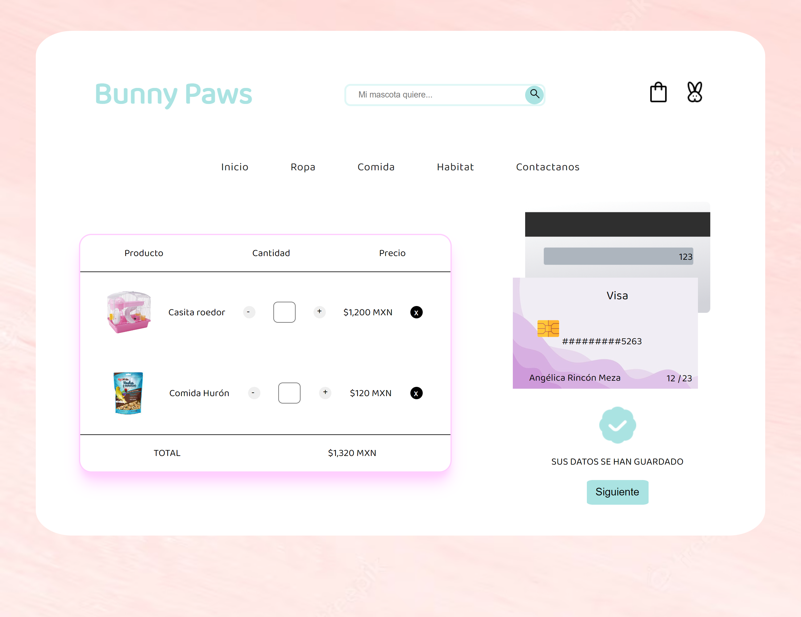

# Tarjeta de crédito válida

## Índice

* [1. Introduccion](#1-introducción)
* [2. Experiencia de usuario](#2-experiencia-de-usuario)
* [3. Decisiones de diseño](#3-decisiones-de-diseño)

***
## 1. Introducción

Este proyecto tiene como finalidad desarrollar una página que, mediante un formulario, se haga uso del algoritmo de Luhn para verificar cualquier número de tarjeta que el usuario decida ingresar y además, ocultar los últimos 4 dígitos de ese mismo número. Este formulario cuenta con diversos campos a llenar, los cuales se deben tomar en cuenta para poder hacer uso de la aplicación. 

El programa evaluará las siguientes condiciones:

* Ningún input se encuentra vacío.
* El input nombre no contiene números.
* El input del número de tarjeta no contiene letras.
* El input del número de tarjeta cumple con el algoritmo de Luhn.
* El input del mes se encuentra dentro del rango 1 al 12.
* El input del año es igual o mayor al año actual.
* El input de CCV tiene una extensión de 3 digitos.

Interfaz de usuario:

## 2. Experiencia de usuario

El contexto en el que englobe este programa fue la simulación de una página de e-commerce especializado en usuarios que tienen mascotas y deseen adquirir productos relacionados de primera y segunda necesidad (ropa, hábitat). El usuario podrá validar sus datos de tarjeta, destinada a servir como método de pago mediante una página html. Una vez que el usuario seleccione el botón "confirmar", se verificaran sus datos de acuerdo a las condiciones previamente descritas.

Si cumple con todas esas condiciones, se le verificara al usuario que sus datos son correctos y podría continuar con su compra. Aunado a ello, el usuario podrá verificar si su tarjeta corresponde a alguna franquicia y además, visualizará el número con caracteres ocultos. Estos dos últimos puntos no significarían la aprobación o rechazo de sus datos bancarios.

De esta forma, el usuario podrá tener acceso a una plataforma coherente para validar sus datos bancarios con la finalidad de comprar productos de una manera rápida.

## 3. Decisiones de diseño

Hice un prototipo de baja fidelidad donde exploraba la idea de tener una interfaz con figuras redondeadas y colores pastel, expresando así mi propio concepto de una mascota afelpada a mi interfaz de usuario.

Prototipo de baja fidelidad:

Paleta de colores elegida:

La posición de cada uno de los elementos fue elegida a partir de una corta investigación de diversos diseños de método de pago en páginas e-commerce, encontrando así un formato general. 

La página permite actualizar la visualización de los datos bancarios en tiempo real, dentro de un diseño de tarjeta de crédito. Elegí esta funcionalidad para aumentar la interacción del usuario y como un ejercicio didáctico adicional a los objetivos del proyecto.

